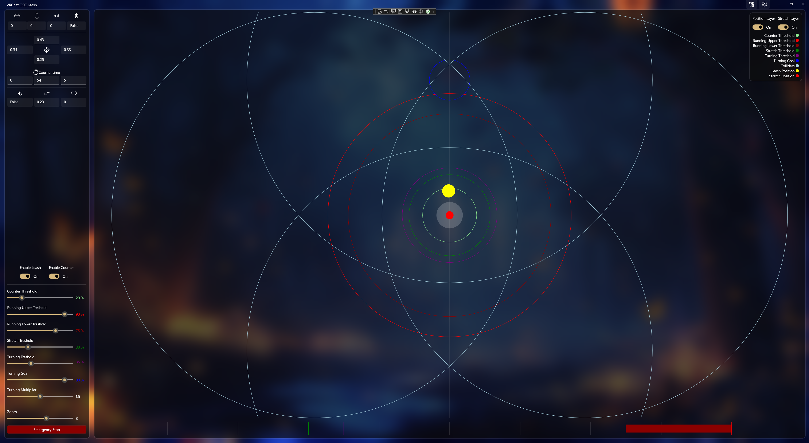

# VOL-VRChatOSCLeash

**VRChat OSC Leash (VOL)** is a Windows application that allows other players in **VRChat** to "drag" your avatar in a specific direction using a leash.

This project was initially built for fun, but grew into a fully functioning desktop application with a visual interface.

---

## Features

- Live visualization of leash direction and position relative to the avatar.
- Counter support that counts the amount of seconds you've been "dragged"
- Configurable movement thresholds.
- Visual feedback UI for OSC data being received and sent.
- Unity prefab support for adding leash functionality to custom avatars.
- Full support for VRChat OSC on Windows.

---

## Project Structure

```plaintext
/installer             - Inno Setup installer script for building installers
/src/VRChatOSCLeash    - WinUI 3 C# desktop application
/unity                 - Unity project containing prefabs to be added to VRChat avatars
```

---

## Application Overview



The WinUI application includes:

- A simple feedback displaying real-time OSC data.
- Slider-based settings to adjust thresholds for leash responsiveness.
- A top-down visualizer showing the current leash vector and threshold zones.

The Unity project:
- Contains the scenes and resources to create a untiy package with prefabs.

---

## Getting Started
Using the Installer
- Download and run the installer (see Releases (RC1 coming soon)).
- Setup your avatar with the required prefabs and OSC parameters (wiki coming soon!).
- After installation, launch VOS-VRChatOSCLEash from the Start Menu.
- Boot into VRChat and have fun!

---

## ⚙Building from Source
Prerequisites: The app uses WinUI 3 with the Windows APP SDK and .net 9.0.
Selecting the option "WinUI application development" under "Desktop & Mobile" in the Visual Studio Installer should suffice.

To build manually run:
```powershell
.\build.ps1
```

---

## Platform Support

| Platform | Supported |
| -------- | --------- |
| Windows  | ✅         |
| Others   | ❌         |

---

## Setup Instructions for VRChat Avatars

⚠️ A full setup guide will be available soon in the form of a GitHub Wiki.

For now, the general steps are:

- Open your VRChat Unity project.
- Import the required prefab(s) from the unity folder.
- Configure the OSC parameters as needed to match what the app expects.

---

## Contributing

Contributions are currently **not** accepted until the first official release is completed. Stay tuned!

---

## License

This project is licensed under the [GPL-3.0 license](https://github.com/AsyncException/VOL-VRChatOSCLeash/blob/main/LICENSE).


